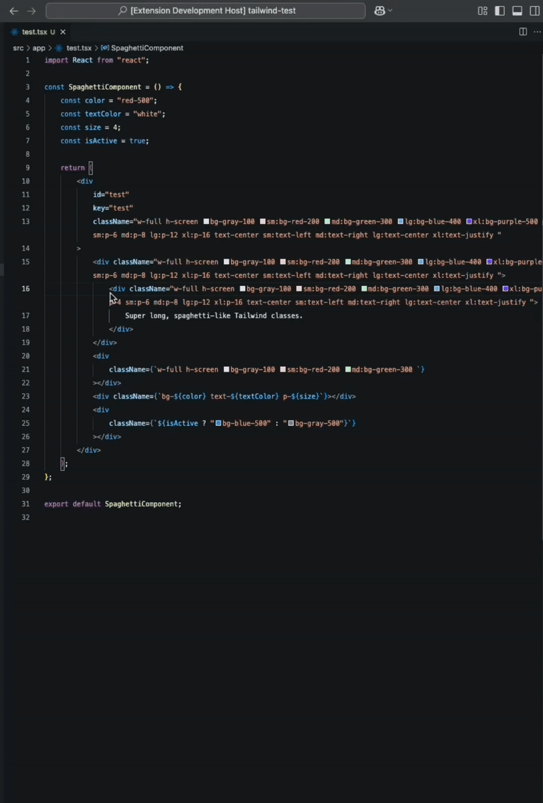
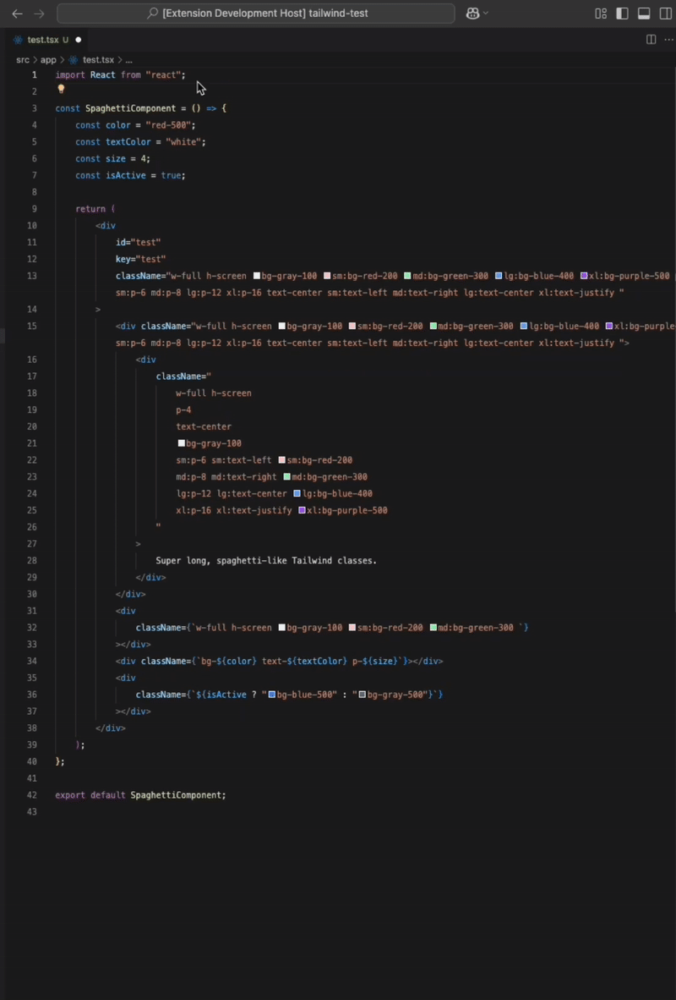

# Tailwind Formatter - Class Organization, Your Way

Wrestling with messy class strings or opinionated formatting styles? Tailwind Formatter lets you enjoy neatly categorized, consistently formatted utility classes that make your code more readable and maintainable — _your way_.

## Features

- 🧩 **Customizable Class Organization**: Group Tailwind classes by customizable prefix-based categories.

- 📱 **Responsive Class Organization**: Specialized organization for viewport/breakpoint classes (sm:, md:, lg:, etc.).

- ⚡ **Dynamic Expression Preservation**: Maintains dynamic expressions intact while organizing static classes.

- 📏 **Flexible Line Formatting**: Configure single-line or multi-line formatting with customizable thresholds.

- 🔍 **Range Formatting**: Format selections without disrupting surrounding code structure.

- 📄 **Full Document Formatting**: Format the entire document with built-in commands.

- 💾 **Format on Save**: Can be set as the default formatter through VS Code settings.

- 🌐 **Multi-language Support [ENHANCED]**: Improved support for HTML, Astro, Vue, Svelte, Blade, PHP, and Elixir files. See [Multi-language Support](#multi-language-support) for more details.

## Getting Started

1. Install the extension from the [Marketplace](https://marketplace.visualstudio.com/items?itemName=Myhtica.tailwind-formatter) or directly from the [Repository](https://github.com/Myhtica/tailwind-formatter/releases/tag/v1.0.0).
2. Check below on the extension's formatting options, settings, and class organization.
3. Modify the extension settings to create your own preferred formatting style.
4. Format your classes — the way you want to!

## Formatting Options

- **Format Selection**: Select JSX code, right-click and select "Format Selection"



- **Format Document**: Right-click in a JSX/TSX file and select "Format Document"



- **Command Palette**: Open the VS Code Command Palette (press Ctrl+Shift+P or ⌘+Shift+P) and search for "Format Tailwind Classes"


### Format On Save

To enable automatic formatting when saving files:

1. Open VS Code settings

2. Search for "Format on Save" and enable it

3. Search for "Default Formatter" and select "Tailwind Formatter"

You can also place the following inside of your user's or workspace's VS Code `settings.json` file. The following will enable automatic formatting for typescript and javascript files:

```
{
  "[typescriptreact]": {
    "editor.defaultFormatter": "Myhtica.tailwind-formatter"
  }
  "[javascriptreact]": {
    "editor.defaultFormatter": "Myhtica.tailwind-formatter"
  },
  "editor.formatOnSave": true
}
```

### Important: Range Formatting vs. Document Formatting

The extension handles range (selection) formatting a bit differently from full document formatting:

**Range Formatting**

Range formatting (selecting part of your code and formatting just that section) has several important requirements to work correctly:

- **Complete JSX elements are required** - your selection must include both opening and closing tags

- **Include leading indentation** - your selection must include all whitespace before the JSX elements, not just start at the `<` character

**Example of correct selection for range formatting:**

```jsx
<div className="p-4 m-2 text-center"></div>
```

**Example of incorrect selection for range formatting:**

```jsx
<div className="p-4 m-2 text-center">
```

> **Note**: Prettier is **not** applied during range formatting to preserve the original structure.

**Full Document Formatting**

- Formats all Tailwind classes in the document

- Applies Prettier and post-processing for consistent code style (for cases where formatting class names affects the surrounding code structure)

**When to use each approach:**

- **Range Formatting**: Use when wanting to organize specific Tailwind classes without affecting the surrounding code structure. Highly recommended to start with this approach to safely format specific sections of your code.

  **IMPORTANT: Always use Range Formatting for file types other than JSX/TSX.**

- **Full Document Formatting**: Use this when you want comprehensive formatting across your entire file. Best for new files or when you're ready to standardize all Tailwind classes.

- **Format on Save**: Convenient for ongoing projects but use with caution. While powerful for maintaining consistency, it may produce unexpected results in complex documents. Consider testing thoroughly before enabling project-wide.

## Multi-language Support

Tailwind Formatter now provides support for multiple languages through two specialized formatting engines:

### AST-based Formatting (Full Support)

- **JSX/TSX**: Complete support with dynamic expression preservation, responsive class organization, and all other features

### Regex-based Formatting (No Dynamic Classes)

- **Astro**: (.astro files)
- **Vue**: (.vue files)
- **Svelte**: (.svelte files)
- **Laravel** (.blade.php files)
- **PHP**: (.php files)
- **Elixir**: (.ex, .exs files)
- **HTML**: (.html files)

For non-JSX/TSX languages, the formatter works best with static class strings. Dynamic class expressions are preserved but not categorized in these languages. It is still highly recommended to continue using "Format Selection" for other languages due to potential errors or edge cases with the regex approach.

### Language-specific Features

- **Regex-based Parsing**: Regex-based parsing now handles both JSX and HTML elements appropriately. Range-based selections no longer require complete elements and can format classes with just the opening html tag.
- **Automatic Prettier Integration**: The extension now detects and uses the appropriate Prettier parser for each language
- **Plugin Support**: Automatically works with language-specific Prettier plugins when available (Svelte, Astro, PHP, etc.)
- **Format on Save**: Works with all supported languages

### Best Practices for Non-JSX/TSX Languages

For the best experience with non-JSX/TSX files:

1. When using range formatting, although your selection no longer requires complete elements, including the leading whitespace is still recommended for indentation purposes.
2. For complex templates with many dynamic expressions, use range formatting on specific sections rather than formatting the entire document
3. If formatting fails, try selecting a smaller portion of your code with the "Format Selection" command instead of "Format Document."
4. If you encounter any issues with a particular language, please report them on GitHub.

> **Note**: When using regex-based formatting, the extension only has access to the opening tag and class attribute, not the closing tag or surrounding context. This means that if a one-line class becomes multi-line during formatting, the indentation of the closing quotes/tags might appear misaligned. This is a limitation of the regex-based approach and primarily affects HTML-like languages.

### Adding Support for More Languages

If you'd like support for additional languages, please open an issue or create a PR on Github.

## Extension Settings

| Setting                                                    | Description                                                     |
| ---------------------------------------------------------- | --------------------------------------------------------------- |
| `tailwindFormatter.classes.categories`                     | Categories for grouping Tailwind CSS classes                    |
| `tailwindFormatter.classes.uncategorizedPosition`          | Where to place uncategorized static classes                     |
| `tailwindFormatter.viewports.breakpoints`                  | Viewport breakpoints to group classes by                        |
| `tailwindFormatter.viewports.grouping`                     | How to group viewport-specific classes                          |
| `tailwindFormatter.lineFormatting.multiLineClasses`        | When true, always format Tailwind classes on multiple lines     |
| `tailwindFormatter.lineFormatting.multiLineClassThreshold` | Format classes on multiple lines when width exceeds this number |
| `tailwindFormatter.indentation.usesTabs`                   | Use tabs for indentation instead of spaces                      |
| `tailwindFormatter.indentation.tabSize`                    | Number of spaces to use for indentation                         |
| `tailwindFormatter.prettier.useProjectPrettierConfig`      | Use your project's Prettier config if available                 |
| `tailwindFormatter.prettier.config`                        | Prettier configuration for the extension                        |
| `tailwindFormatter.suppressNonJSXWarning`                  | Suppress warnings about non-JSX/TSX formatting limitations      |

## Class Organization

The extension organizes classes in three main ways:

### 1. Categories

Classes are grouped by user-defined categories. Each category is defined by a space-separated list of prefixes that determine what classes belong to that category.

When configuring category prefixes in `tailwindFormatter.classes.categories`, follow these guidelines for accurate class matching:

**Hyphenated Classes**: Add the prefix with a trailing hyphen (e.g., `p-`, `m-`, `w-`)

**Standalone Classes**: Include the exact class name (e.g., `block`, `container`, `hidden`)

**Variant Prefixes**: Add the full prefix with a colon (e.g., `hover:`, `focus:`, `dark:`)

> **Some things to note**:

> - Categories are used to group both static and _simple dynamic_ Tailwind classes (e.g. _bg-${color}_). Complex dynamic classes with ternaries or expressions are handled separately.

> - Specificity takes precedence for all prefix cases. For example, if there exists a general `hover:` prefix for _Category 1_ and a more specific `hover:bg-` prefix in _Category 2_, classes like `hover:bg-blue-500` will be categorized under _Category 2_ because it has a more specific (longer) matching prefix.

**Example Configuration:**

```json
"tailwindFormatter.classes.categories": {
  "Layout": "container flex grid block inline hidden visible z-",
  "Sizing": "w- h- min- max-",
  "Spacing": "p- m- space-",
  "Typography": "text- font- leading- tracking-",
  "Background": "bg- from- via- to-",
  "Borders": "border rounded- divide-",
  "Effects": "shadow- opacity- transition- transform-"
}
```

This produces neatly organized classes:

```jsx
className={`
  flex items-center justify-between  /* Layout */
  w-full h-12                        /* Sizing */
  p-4 m-2                            /* Spacing */
  text-gray-800 font-medium          /* Typography */
  bg-white                           /* Background */
  border-b border-gray-200           /* Borders */
  shadow-sm                          /* Effects */
`}
```

You can organize categories however makes sense for your project. The extension provides a default configuration that works well for most projects, but you're encouraged to customize it for your specific needs.

### 2. Viewport/Responsive Classes

Responsive classes (sm:, md:, lg:, etc.) are handled separately from categories through dedicated viewport settings:

- `tailwindFormatter.viewports.breakpoints`: Define your breakpoint prefixes in order (e.g., ["sm", "md", "lg"])

- `tailwindFormatter.viewports.grouping`: Choose how to group viewport-specific classes:

  - `"separate"` (default): Groups all classes for the same viewport together on one line

  - `"separate-categorized"`: Separates by viewport first, then applies category organization within each viewport group

  - `"inline"`: Groups by category first, then places viewport variations inline within each category

**With `"separate"` grouping (default):**

```jsx
className={`
  p-4 m-2 text-sm
  sm:p-3 sm:m-3 sm:text-base
  lg:p-4 lg:m-4 lg:text-lg
`}
```

**With `"separate-categorized"` grouping:**

```jsx
className={`
  p-4 m-2
  text-sm
  sm:p-3 sm:m-3
  sm:text-base
  lg:p-4 lg:m-4
  lg:text-lg
`}
```

**With `"inline"` grouping:**

```jsx
className={`
  p-4 sm:p-3 lg:p-4
  m-2 sm:m-3 lg:m-4
  text-sm sm:text-base lg:text-lg
`}
```

### 3. Dynamic Classes

Dynamic classes (using template literals, conditionals, or function calls) are preserved in their original form and positioned after categorized static classes. This separation maintains both the logic of dynamic expressions and ensures reliable CSS precedence:

```jsx
className={`
  text-gray-500 p-4                  /* Static base styles */
  ${isActive ? 'text-blue-500' : ''} /* Dynamic modifiers */
`}
```

> **Note**: Due to their complex nature (potentially containing multiple classes in a single expression), dynamic classes are not categorized.

## Additional Features

### Class Line Formatting

Tailwind classes can be formatted on single or multiple lines based on your preferences. Configure using `multiLineClasses` and `multiLineClassThreshold` settings.

### Indentation

Control indentation using tabs or spaces with the `usesTabs` and `tabSize` settings. When Prettier integration is enabled, Prettier's indentation settings (if present) will take precedence for general formatting. Your extension settings will still be used for consistent className attribute indentation and as fallbacks when Prettier doesn't specify indentation preferences.

### Prettier Integration

The extension comes with Prettier built-in to ensure consistent formatting. To customize Prettier formatting, you can:

- Use your project's `.prettierrc` file (if it exists) by enabling `tailwindFormatter.prettier.useProjectPrettierConfig` (enabled by default)

- Customize Prettier settings directly through the `tailwindFormatter.prettier.config` extension setting

> **Note**: You don't need to install Prettier in your project - it's already included with the extension. The extension will read your `.prettierrc` configuration file if present, but uses its own Prettier installation. However, it does not directly interact with or extract settings from an external Prettier extension installed in VS Code.

## Known Issues

- [ *WARNING* ] Range formatting for JSX/TSX requires complete elements with leading indentation
- [ *WARNING* ] Range formatting doesn't apply Prettier (by design, to preserve structure)
- [ *NOTE* ] For non-JSX/TSX languages, complex dynamic expressions are ignored.
- [ *MINOR* ] When using regex-based formatting (non-JSX/TSX languages), indentation issues may occur if a one-line class becomes multi-line, as the formatter only has access to the opening tag, not the closing tags or surrounding context

## Release Notes

See the [CHANGELOG](CHANGELOG.md) for details on all releases.

### 2.0.0

- Complete architecture overhaul with dedicated formatting engines for different languages
- Enhanced support for HTML, Astro, Vue, Svelte, Blade, PHP, and Elixir files
- Language-specific Prettier integration with plugin support
- Improved error handling and user notifications
- New warning system for non-JSX/TSX limitations with option to suppress

### 1.1.0

- Added limited support for additional languages: Astro, Vue, Svelte, Laravel Blade, PHP, Elixir, and HTML (range formatting only)
- Improved error messages for unsupported formatting operations
- Modified configuration system to handle multiple language types

### 1.0.0

- Initial release of Tailwind Formatter

## Contributing

Contributions are welcome! See [CONTRIBUTING.md](CONTRIBUTING.md).

## License

This project is licensed under the MIT open source license. See [LICENSE.md](LICENSE.md).

## Sponsor

If you liked this extension or it helped you or your team, please consider donating/sponsoring! It would be a huge help for me. Thank you for the support!

[](https://github.com/sponsors/myhtica-myht)

## Sponsors

Thank you to all the amazing sponsors who support this project! ❤️

- No one here yet! Be the first one!

---

**Enjoy formatting your Tailwind classes!!!**
